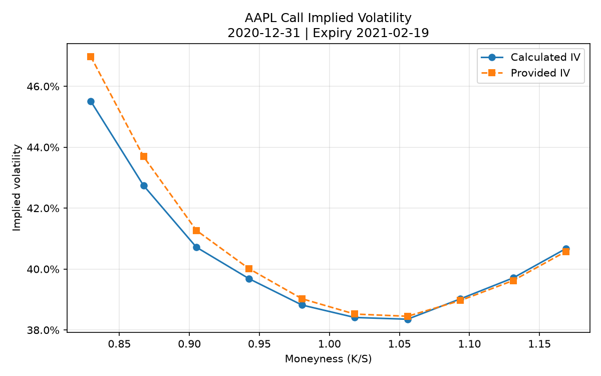

# AAPL Black-Scholes Implied Volatility Analysis

An empirical option pricing study using the Black-Scholes model to investigate the implied volatility structure of Apple Inc. (AAPL) call options.

This project:

- cleans and preprocesses historical option data,
- calculates implied volatility from market prices,
- compares calculated IV with dataset-provided IV,
- validates numerical consistency through repricing,
- visualises the volatility smile pattern.

------------------------------------------------------------------------

## Research Question

The Black-Scholes model assumes a constant volatility parameter.

This project investigates:

> Does the observed market implied volatility structure of AAPL options support the constant volatility assumption?

By extracting implied volatility across different strike prices with the same maturity, the project studies whether a volatility smile exists in real market data.

------------------------------------------------------------------------

## Volatility Smile Result

The final volatility smile is shown below:



------------------------------------------------------------------------

# Project Structure

```text
.
├── data/
│
│   ├── raw/
│   │   ├── AAPL_options.csv
│   │   └── AAPL_stock_price.csv
│   │
│   └── processed/
│       ├── AAPL_options_clean.csv
│       └── AAPL_research_sample.csv
│
├── src/
│
│   ├── bs_model.py
│   │   Black–Scholes European call pricing model
│   │
│   ├── implied_vol.py
│   │   Numerical inversion of option prices to implied volatility
│   │
│   ├── preprocess_options.py
│   │   Cleaning and constructing option market prices
│   │
│   ├── sample_selection.py
│   │   Selecting research samples by quote date and maturity
│   │
│   ├── analysis.py
│   │   Calculating and comparing implied volatilities
│   │
│   ├── validate_iv.py
│   │   Repricing validation of calculated IVs
│   │
│   └── plot_iv.py
│       Visualization of volatility smile
│
├── scripts/
│
│   ├── explore_data.py
│   │   Initial dataset inspection
│   │
│   └── check_sample.py
│       Research sample verification
│
├── results/
│
│   ├── AAPL_IV_comparison.csv
│   ├── AAPL_IV_validation.csv
│   ├── AAPL_volatility_smile.png
│   └── research_summary.txt
│
├── README.md
└── requirements.txt

------------------------------------------------------------------------

## Research Workflow

The project is structured as an empirical quantitative analysis pipeline.

### 1. Data Preparation

Historical AAPL option-chain data are cleaned and transformed into a consistent research dataset.

The preprocessing stage:

- handles missing and inconsistent fields,
- constructs option market prices using bid–ask midpoints,
- removes unsuitable observations.

Output:

`AAPL_options_clean.csv`


### 2. Research Sample Construction

A fixed quote date and expiration date are selected to study the cross-sectional relationship between strike prices and implied volatility.

This avoids mixing options with different maturities, allowing a clearer analysis of the volatility smile.

Output:

`AAPL_research_sample.csv`


### 3. Model Implementation

The Black–Scholes European call option model is implemented from first principles.

Given:

- underlying price,
- strike price,
- time to maturity,
- interest rate,
- volatility,

the model calculates theoretical option prices.


### 4. Implied Volatility Extraction

Because volatility is not directly observable, the project numerically solves:

\[
BS(S,K,T,r,\sigma)=MarketPrice
\]

using Brent's root-finding algorithm.

The resulting volatility parameter is interpreted as the market-implied volatility under the model assumptions.


### 5. Model Validation

Each calculated IV is substituted back into the pricing model.

The resulting theoretical price is compared with the original market price to verify numerical consistency.


### 6. Volatility Smile Analysis

Calculated implied volatility is plotted against moneyness:

\[
K/S
\]

to examine the deviation from the constant-volatility assumption of Black–Scholes.

------------------------------------------------------------------------

Data Processing

Raw Data

The original option dataset:

data/raw/AAPL_options.csv

contains historical AAPL option chain data.

The stock price file:

data/raw/AAPL_stock_price.csv

contains historical underlying price information.

The option dataset includes:

-   quote date
-   expiration date
-   underlying price
-   strike price
-   bid/ask quotes
-   last traded price
-   provided implied volatility

------------------------------------------------------------------------

Data Preprocessing

Script:

src/preprocess_options.py

Purpose:

-   read the large option dataset,
-   handle inconsistent column formats,
-   construct a cleaner option price field,
-   save processed data.

Output:

data/processed/AAPL_options_clean.csv

The option market price is calculated using bid and ask quotes:

MARKET_PRICE = (C_BID + C_ASK) / 2

when valid quotes are available.

This is preferred over C_LAST because the last traded price may not
represent the current market quote.

------------------------------------------------------------------------

Research Sample Selection

Script:

src/sample_selection.py

The research sample is restricted to:

-   one quote date,
-   one expiration date,
-   call options only,
-   reasonable moneyness range.

Final research sample:

data/processed/AAPL_research_sample.csv

Sample:

Quote date: 2020-12-31

Expiration date: 2021-02-19

Sample size: 10 call options

Underlying price: 132.6

------------------------------------------------------------------------

Model

Black–Scholes European Call Model

File:

src/bs_model.py

The project uses the European Black–Scholes call option formula:

C = S exp(-qT) N(d1) - K exp(-rT) N(d2)

where:

d1 = [ln(S/K)+(r-q+sigma²/2)T] / (sigma sqrt(T))

d2 = d1 - sigma sqrt(T)

Parameters:

S: Underlying price

K: Strike price

T: Time to maturity in years

r: Risk-free interest rate

q: Continuous dividend yield

sigma: Volatility

------------------------------------------------------------------------

Model Assumptions

The analysis uses:

Risk-free rate:

r = 0.001

Dividend yield:

q = 0.0

Time conversion:

T = DTE / 365

These are simplifying assumptions for this research project.

They are not calibrated from market data.

------------------------------------------------------------------------

Implied Volatility Calculation

File:

src/implied_vol.py

The implied volatility is obtained by solving:

Black-Scholes price = Market option price

using Brent’s numerical root-finding method.

The output volatility is:

CALCULATED_IV

Important:

CALCULATED_IV is not a prediction of future volatility.

It is the volatility parameter that makes the Black–Scholes model
reproduce the observed option price.

------------------------------------------------------------------------

Analysis

File:

src/analysis.py

The script:

1.  loads the research sample,
2.  calculates implied volatility,
3.  compares it with the dataset-provided volatility.

The comparison is:

IV_DIFFERENCE = CALCULATED_IV - C_IV

------------------------------------------------------------------------

Validation

File:

src/validate_iv.py

The calculated IV is substituted back into the Black–Scholes model.

Purpose:

ModelPrice ≈ MarketPrice

This validates numerical consistency of the IV solver.

It does not prove that the Black–Scholes model is the correct market
pricing model.

------------------------------------------------------------------------

Visualization

File:

src/plot_iv.py

The script plots:

-   calculated implied volatility,
-   provided implied volatility,

against:

Moneyness = K / S

Output:

results/AAPL_volatility_smile.png

------------------------------------------------------------------------

Running the Project

Create environment:

python3 -m venv .venv

Activate:

source .venv/bin/activate

Install dependencies:

pip install -r requirements.txt

Run:

python3 src/analysis.py

python3 src/validate_iv.py

python3 src/plot_iv.py

------------------------------------------------------------------------

Generated Results

IV Comparison

results/AAPL_IV_comparison.csv

Contains:

-   strike price
-   moneyness
-   market price
-   calculated IV
-   provided IV
-   IV difference

IV Validation

results/AAPL_IV_validation.csv

Contains:

-   calculated volatility
-   repriced option value
-   pricing error

Volatility Smile Plot

results/AAPL_volatility_smile.png

Shows the relationship between strike moneyness and implied volatility.

------------------------------------------------------------------------

Experimental Results

Research sample:

Quote date:

2020-12-31

Expiration date:

2021-02-19

Sample size:

10 call options

All 10 options successfully produced implied volatility values.

Calculated IV range:

Minimum:

0.383534

Maximum:

0.455107

The calculated IV decreased from approximately 45.51% at strike 110 to
around 38.35% at strike 140, then increased again toward strike 155.

This produces a typical volatility smile pattern.

------------------------------------------------------------------------

Comparison With Provided IV

The largest difference between calculated IV and provided C_IV was
approximately:

1.47 percentage points

at strike:

K = 110

Differences became smaller near at-the-money strikes.

Possible explanations include:

-   different quote inputs,
-   different interest rate assumptions,
-   dividend treatment,
-   pricing model differences.

------------------------------------------------------------------------

Validation Results

All 10 samples were successfully repriced.

Successful calculations:

10 / 10

Maximum absolute pricing error:

0.0000000000

Mean absolute pricing error:

0.0000000000

This confirms numerical consistency of the implementation.

------------------------------------------------------------------------

Limitations

Black–Scholes Model Assumption

The model prices European-style call options.

However, listed AAPL options are generally American-style.

Therefore, differences between calculated IV and market-provided IV may
occur.

Dividend Assumption

AAPL pays dividends, but this analysis assumes:

q = 0

A non-zero dividend yield may affect implied volatility results.

Interest Rate Assumption

The project uses:

r = 0.001

The actual historical risk-free rate may differ.

Sample Size

The conclusion is based on:

10 option contracts

from one trading date and one expiration date.

The result should not be generalized to all AAPL options.

------------------------------------------------------------------------

Future Improvements

Possible extensions:

-   incorporate historical dividend yield,
-   use Treasury rates matching each quote date,
-   compare European and American option models,
-   analyze multiple expiration dates,
-   build volatility surfaces,
-   perform parameter calibration using multiple option prices.
